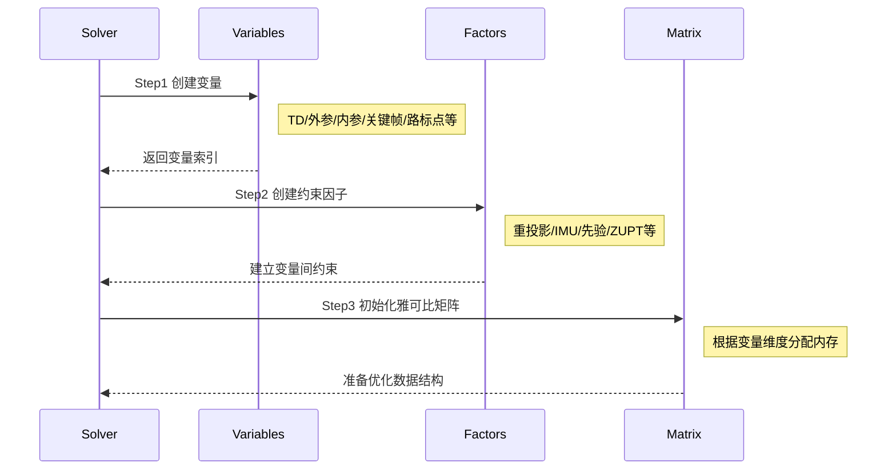

```mermaid
sequenceDiagram
    participant Solver
    participant Variables
    participant Factors
    participant Matrix
    
    Solver->>Variables: Step1 创建变量
    Note right of Variables: TD/外参/内参/关键帧/路标点等
    Variables-->>Solver: 返回变量索引
    
    Solver->>Factors: Step2 创建约束因子
    Note right of Factors: 重投影/IMU/先验/ZUPT等
    Factors-->>Solver: 建立变量间约束
    
    Solver->>Matrix: Step3 初始化雅可比矩阵
    Note right of Matrix: 根据变量维度分配内存
    Matrix-->>Solver: 准备优化数据结构
```
