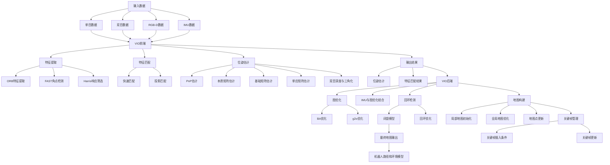

```mermaid
graph TD
    %% 输入数据
    A[输入数据] --> B[单目数据]
    A[输入数据] --> C[双目数据]
    A[输入数据] --> D[RGB-D数据]
    A[输入数据] --> E[IMU数据]

    %% VIO前端
    B --> F[VIO前端]
    C --> F[VIO前端]
    D --> F[VIO前端]
    E --> F[VIO前端]

    %% 特征提取
    F --> G[特征提取]
    G --> H[ORB特征提取]
    G --> I[FAST角点检测]
    G --> J[Harris响应筛选]

    %% 特征匹配
    F --> K[特征匹配]
    K --> L[快速匹配]
    K --> M[投影匹配]

    %% 位姿估计
    F --> N[位姿估计]
    N --> O[PnP估计]
    N --> P[本质矩阵估计]
    N --> Q[基础矩阵估计]
    N --> R[单应矩阵估计]
    N --> S[双目深度与三角化]

    %% 输出
    F --> T[输出结果]
    T --> U[位姿估计]
    T --> V[特征匹配结果]
    
    %% 后端优化
    T --> W[VIO后端]
    W --> X[图优化]
    W --> Y[IMU与图优化结合]

    %% 回环检测
    W --> Z[回环检测]
    Z --> AA[词袋模型]
    Z --> AB[回环优化]

    %% 地图构建
    W --> AC[地图构建]
    AC --> AD[局部地图初始化]
    AC --> AE[全局地图优化]
    AC --> AF[地图点更新]

    %% 关键帧管理
    AC --> AG[关键帧管理]
    AG --> AH[关键帧插入条件]
    AG --> AI[关键帧更新]

    %% 后端优化细节
    X --> AJ[BA优化]
    X --> AK[g2o优化]
    
    %% 输出最终结果
    AA --> AL[最终地图输出]
    AL --> AM[机器人路径和环境模型]


```