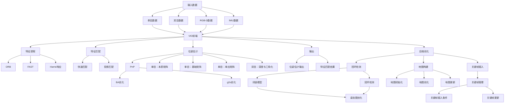

```mermaid
graph TD
    A[输入数据] --> B[单目数据]
    A[输入数据] --> C[双目数据]
    A[输入数据] --> D[RGB-D数据]
    A[输入数据] --> E[IMU数据]

    B --> F[VIO前端]
    C --> F[VIO前端]
    D --> F[VIO前端]
    E --> F[VIO前端]

    F --> G[特征提取]
    F --> H[特征匹配]
    F --> I[位姿估计]
    F --> J[输出]

    G --> K[ORB]
    G --> L[FAST]
    G --> M[Harris响应]

    H --> N[快速匹配]
    H --> O[投影匹配]

    I --> P[PnP]
    I --> Q[单目：本质矩阵]
    I --> R[单目：基础矩阵]
    I --> S[单目：单应矩阵]
    I --> T[双目：深度与三角化]

    J --> U[位姿估计输出]
    J --> V[特征匹配结果]

    P --> W[BA优化]
    P --> X[g2o优化]

    F --> Y[后端优化]

    Y --> Z[回环检测]
    Y --> AA[地图构建]
    Y --> AB[关键帧插入]

    Z --> AC[词袋模型]
    Z --> AD[回环检测]

    AC --> AE[全局优化]
    AD --> AE[姿态图优化]

    AA --> AF[地图初始化]
    AA --> AG[地图优化]
    AA --> AH[地图更新]

    AB --> AI[关键帧管理]

    AI --> AJ[关键帧插入条件]
    AI --> AK[关键帧更新]
```
