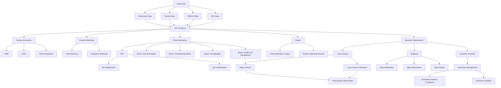

```mermaid
graph TD
    A[Input Data] --> B[Monocular Data]
    A[Input Data] --> C[Stereo Data]
    A[Input Data] --> D[RGB-D Data]
    A[Input Data] --> E[IMU Data]

    B --> F[VIO Frontend]
    C --> F[VIO Frontend]
    D --> F[VIO Frontend]
    E --> F[VIO Frontend]

    F --> G[Feature Extraction]
    F --> H[Feature Matching]
    F --> I[Pose Estimation]
    F --> J[Output]

    G --> K[ORB]
    G --> L[FAST]
    G --> M[Harris Response]

    H --> N[Fast Matching]
    H --> O[Projection Matching]

    I --> P[PnP]
    I --> Q[Mono: Essential Matrix]
    I --> R[Mono: Fundamental Matrix]
    I --> S[Mono: Homography]
    I --> T[Stereo Depth and Triangulation]

    J --> U[Pose Estimation Output]
    J --> V[Feature Matching Results]

    P --> W[BA Optimization]
    P --> X[g2o Optimization]

    F --> Y[Backend Optimization]

    Y --> Z[Loop Closure]
    Y --> AA[Mapping]
    Y --> AB[Keyframe Insertion]

    Z --> AC[Bag of Words]
    Z --> AD[Loop Closure Detection]

    AC --> AE[Global Optimization]
    AD --> AE[Pose-graph Optimization]

    AA --> AF[Map Initialization]
    AA --> AG[Map Optimization]
    AA --> AH[Map Update]

    AB --> AI[Keyframe Management]

    AI --> AJ[Keyframe Insertion Conditions]
    AI --> AK[Keyframe Updates]
```