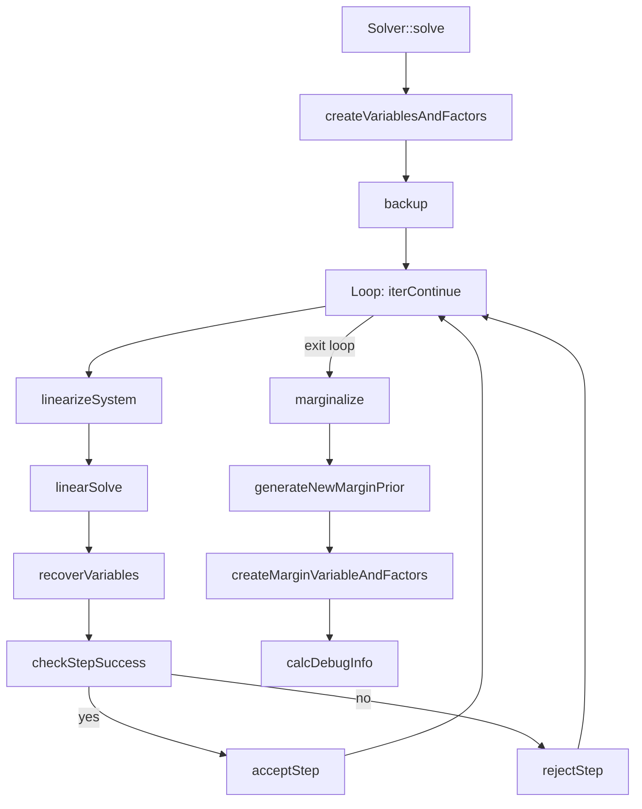

```mermaid
flowchart TD
  A[Solver::solve] --> B[createVariablesAndFactors]
  B --> C[backup]
  C --> D[Loop: iterContinue]
  D --> E[linearizeSystem]
  E --> F[linearSolve]
  F --> G[recoverVariables]
  G --> H[checkStepSuccess]
  H -->|yes| I[acceptStep]
  H -->|no| J[rejectStep]
  I --> D
  J --> D
  D -->|exit loop| K[marginalize]
  K --> L[generateNewMarginPrior]
  L --> M[createMarginVariableAndFactors]
  M --> N[calcDebugInfo]

```