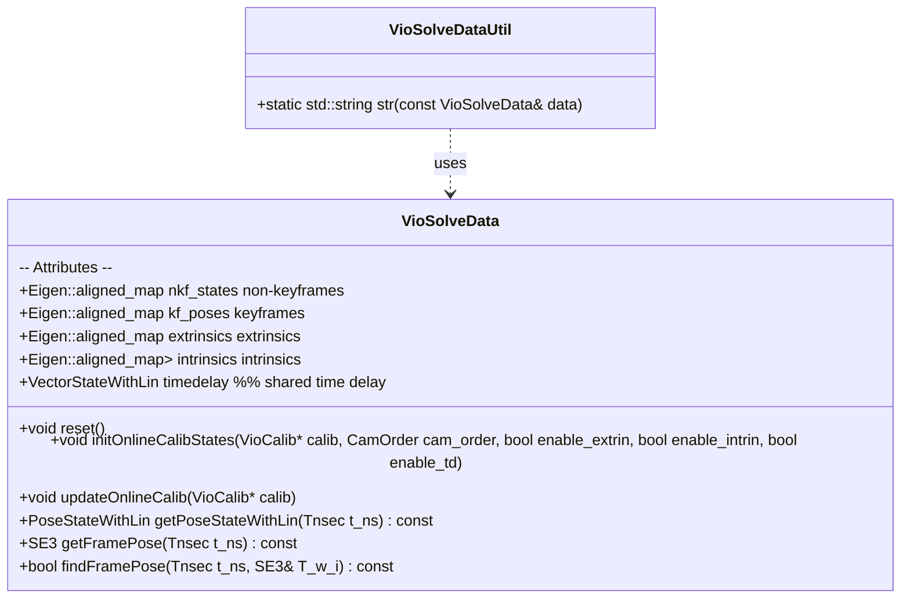

```mermaid
classDiagram
%% 命名空间 xr

class VioSolveData {
  +void reset()
  +void initOnlineCalibStates(VioCalib* calib, CamOrder cam_order, bool enable_extrin, bool enable_intrin, bool enable_td)
  +void updateOnlineCalib(VioCalib* calib)
  +PoseStateWithLin getPoseStateWithLin(Tnsec t_ns) const
  +SE3 getFramePose(Tnsec t_ns) const
  +bool findFramePose(Tnsec t_ns, SE3& T_w_i) const
  -- Attributes --
  +Eigen::aligned_map<Tnsec, PoseVelBiasStateWithLin> nkf_states  non-keyframes
  +Eigen::aligned_map<Tnsec, PoseStateWithLin> kf_poses           keyframes
  +Eigen::aligned_map<int, PoseStateWithLin> extrinsics           extrinsics
  +Eigen::aligned_map<int, VectorStateWithLin<CAM_INTRINSIC_SIZE>> intrinsics  intrinsics
  +VectorStateWithLin<TD_SIZE> timedelay                          %% shared time delay
}

%% 非成员函数
class VioSolveDataUtil {
  +static std::string str(const VioSolveData& data)
}

VioSolveDataUtil ..> VioSolveData : uses

```