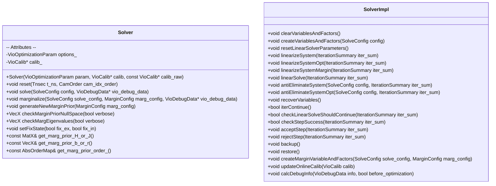

```mermaid
classDiagram
%% 命名空间 xr

class Solver {
  +Solver(VioOptimizationParam param, VioCalib* calib, const VioCalib* calib_raw)
  +void reset(Tnsec t_ns, CamOrder cam_idx_order)
  +void solve(SolveConfig config, VioDebugData* vio_debug_data)
  +void marginalize(SolveConfig solve_config, MarginConfig marg_config, VioDebugData* vio_debug_data)
  +void generateNewMarginPrior(MarginConfig marg_config)
  +VecX checkMarginPriorNullSpace(bool verbose)
  +VecX checkMargEigenvalues(bool verbose)
  +void setFixState(bool fix_ex, bool fix_in)
  +const MatX& get_marg_prior_H_or_J()
  +const VecX& get_marg_prior_b_or_r()
  +const AbsOrderMap& get_marg_prior_order_()
  -- Attributes --
  -VioOptimizationParam options_
  -VioCalib* calib_
}

class SolverImpl {
  +void clearVariablesAndFactors()
  +void createVariablesAndFactors(SolveConfig config)
  +void resetLinearSolverParameters()
  +void linearizeSystem(IterationSummary iter_sum)
  +void linearizeSystemOpt(IterationSummary iter_sum)
  +void linearizeSystemMargin(IterationSummary iter_sum)
  +void linearSolve(IterationSummary iter_sum)
  +void antiEliminateSystem(SolveConfig config, IterationSummary iter_sum)
  +void antiEliminateSystemOpt(SolveConfig config, IterationSummary iter_sum)
  +void recoverVariables()
  +bool iterContinue()
  +bool checkLinearSolveShouldContinue(IterationSummary iter_sum)
  +bool checkStepSuccess(IterationSummary iter_sum)
  +void acceptStep(IterationSummary iter_sum)
  +void rejectStep(IterationSummary iter_sum)
  +void backup()
  +void restore()
  +void createMarginVariableAndFactors(SolveConfig solve_config, MarginConfig marg_config)
  +void updateOnlineCalib(VioCalib calib)
  +void calcDebugInfo(VioDebugData info, bool before_optimization)
}

```