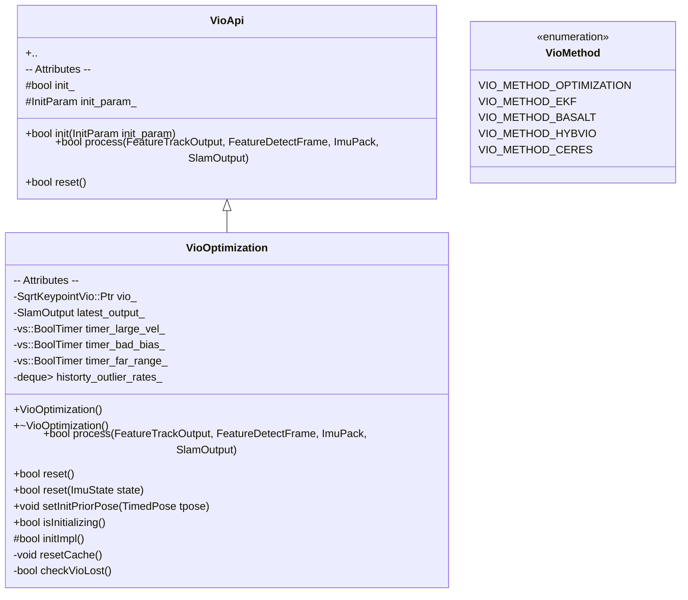

```mermaid
classDiagram
%% 命名空间 xr

class VioApi {
  +bool init(InitParam init_param)
  +bool process(FeatureTrackOutput, FeatureDetectFrame, ImuPack, SlamOutput)
  +bool reset()
  +..
  -- Attributes --
  #bool init_
  #InitParam init_param_
}

class VioOptimization {
  +VioOptimization()
  +~VioOptimization()
  +bool process(FeatureTrackOutput, FeatureDetectFrame, ImuPack, SlamOutput)
  +bool reset()
  +bool reset(ImuState state)
  +void setInitPriorPose(TimedPose tpose)
  +bool isInitializing()
  #bool initImpl()
  -- Attributes --
  -SqrtKeypointVio::Ptr vio_
  -SlamOutput latest_output_
  -vs::BoolTimer timer_large_vel_
  -vs::BoolTimer timer_bad_bias_
  -vs::BoolTimer timer_far_range_
  -deque<pair<Tsec, float>> historty_outlier_rates_
  -void resetCache()
  -bool checkVioLost()
}

class VioMethod {
  <<enumeration>>
  VIO_METHOD_OPTIMIZATION
  VIO_METHOD_EKF
  VIO_METHOD_BASALT
  VIO_METHOD_HYBVIO
  VIO_METHOD_CERES
}

VioApi <|-- VioOptimization

```