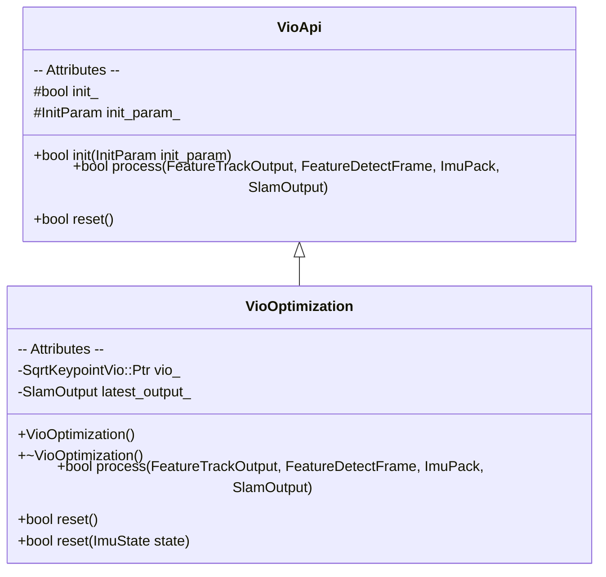

```mermaid
classDiagram
%% 命名空间 xr

class VioApi {
  +bool init(InitParam init_param)
  +bool process(FeatureTrackOutput, FeatureDetectFrame, ImuPack, SlamOutput)
  +bool reset()
  -- Attributes --
  #bool init_
  #InitParam init_param_
}

class VioOptimization {
  +VioOptimization()
  +~VioOptimization()
  +bool process(FeatureTrackOutput, FeatureDetectFrame, ImuPack, SlamOutput)
  +bool reset()
  +bool reset(ImuState state)
  -- Attributes --
  -SqrtKeypointVio::Ptr vio_
  -SlamOutput latest_output_
}


VioApi <|-- VioOptimization

```