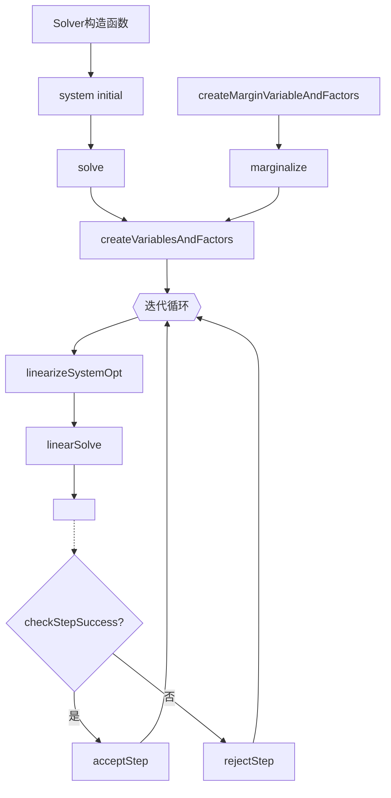

```mermaid
graph TD
    A[Solver构造函数] --> B[system initial]
    B --> C[solve]
    C --> D[createVariablesAndFactors]
    D --> E{{迭代循环}}
    E --> F[linearizeSystemOpt]
    F --> G[linearSolve]

    %% 添加一条平行连接线，帮助引导布局
    G --> GH[ ]
    GH -.-> H{checkStepSuccess?}

    H -- 是 --> I[acceptStep]
    H -- 否 --> J[rejectStep]
    I --> E
    J --> E

    K[marginalize] --> D
    M[createMarginVariableAndFactors] --> K

```