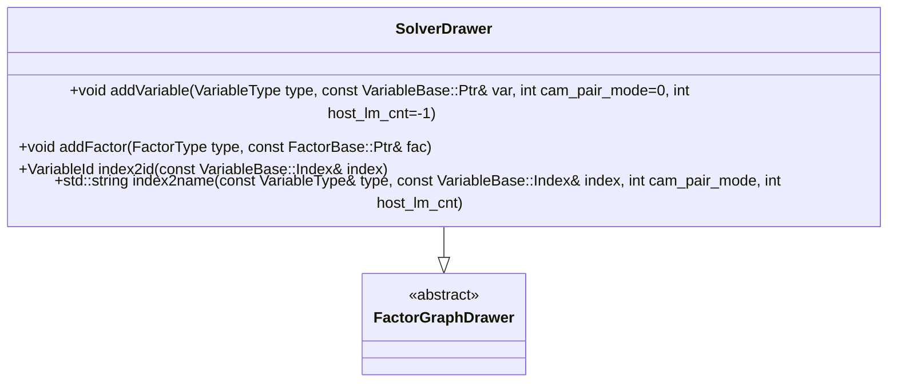

```mermaid
classDiagram
%% 命名空间 xr

class FactorGraphDrawer {
  %% 假设这是已有的基础类
  <<abstract>>
}

class SolverDrawer {
  +void addVariable(VariableType type, const VariableBase::Ptr& var, int cam_pair_mode=0, int host_lm_cnt=-1)
  +void addFactor(FactorType type, const FactorBase::Ptr& fac)
  +VariableId index2id(const VariableBase::Index& index)
  +std::string index2name(const VariableType& type, const VariableBase::Index& index, int cam_pair_mode, int host_lm_cnt)
}

SolverDrawer --|> FactorGraphDrawer

```