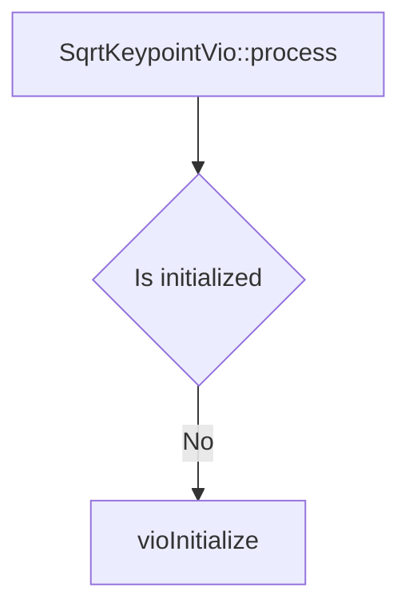

```mermaid
graph TD
    A[SqrtKeypointVio::process] --> B{Is initialized}
    B -- No --> C[vioInitialize]

    %% B --> C[solve主优化]
    %% C --> D[createVariablesAndFactors]
    %% D --> E{{迭代循环}}
    %% E --> F[linearizeSystem]
    %% F --> G[linearSolve]
    %% G --> H{checkStepSuccess?}
    %% H -- 是 --> I[acceptStep]
    %% H -- 否 --> J[rejectStep]
    %% I --> E
    %% J --> E
    %% E --> K[marginalize]
    %% K --> L[generateNewMarginPrior]
    %% K --> M[createMarginVariableAndFactors]
    
    %% subgraph 辅助操作
    %%     N[backup/restore]
    %%     O[checkMarginPriorNullSpace]
    %%     P[updateOnlineCalib]
    %% end
    %% C --> N
    %% K --> O
    %% C --> P

```