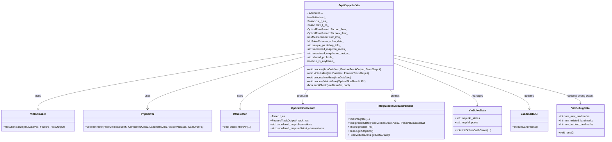

```mermaid
classDiagram

class SqrtKeypointVio {
  +void process(ImuDataVec, FeatureTrackOutput, SlamOutput)
  +void vioInitialize(ImuDataVec, FeatureTrackOutput)
  +void processImuMeas(ImuDataVec)
  +void processVisionMeas(OpticalFlowResult::Ptr)
  +bool zuptCheck(ImuDataVec, bool)
  -- Attributes --
  -bool initialized_
  -Tnsec cur_t_ns_
  -Tnsec prev_t_ns_
  -OpticalFlowResult::Ptr curr_flow_
  -OpticalFlowResult::Ptr prev_flow_
  -ImuMeasurement curr_imu_
  -VioSolveData vio_solve_data_
  -std::unique_ptr<VioDebugData> debug_info_
  -std::unordered_map<Tnsec, IntegratedImuMeasurement::Ptr> imu_meas_
  -std::unordered_map<Tnsec, Vec3> frame_last_w_
  -std::shared_ptr<LandmarkDB> lmdb_
  -bool cur_is_keyframe_
}

class OpticalFlowResult {
  +Tnsec t_ns
  +FeatureTrackOutput* track_res
  +std::unordered_map<int, ObservationMap> observations
  +std::unordered_map<int, UndistortMap> undistort_observations
}

class VioInitializer {
  +Result initialize(ImuDataVec, FeatureTrackOutput)
}

class IntegratedImuMeasurement {
  +void integrate(...)
  +void predictState(PoseVelBiasState, Vec3, PoseVelBiasState&)
  +Tnsec getStartTns()
  +Tnsec getStopTns()
  +PoseVelBiasDelta getDeltaState()
}

class PnpSolver {
  +void estimate(PoseVelBiasState&, ConnectedObs&, LandmarkDB&, VioSolveData&, CamOrder&)
}

class KfSelector {
  +bool checkInsertKF(...)
}

class VioSolveData {
  +std::map<Tnsec, PoseVelBiasStateWithLin> nkf_states
  +std::map<Tnsec, Pose3> kf_poses
  +void initOnlineCalibStates(...)
}

class LandmarkDB {
  +int numLandmarks()
}

class VioDebugData {
  +void reset()
  +int num_new_landmarks
  +int num_existed_landmarks
  +int num_tracked_landmarks
}

SqrtKeypointVio --> VioInitializer : uses
SqrtKeypointVio --> PnpSolver : uses
SqrtKeypointVio --> KfSelector : uses
SqrtKeypointVio --> OpticalFlowResult : produces
SqrtKeypointVio --> IntegratedImuMeasurement : creates
SqrtKeypointVio --> VioSolveData : manages
SqrtKeypointVio --> LandmarkDB : updates
SqrtKeypointVio --> VioDebugData : optional debug output

```