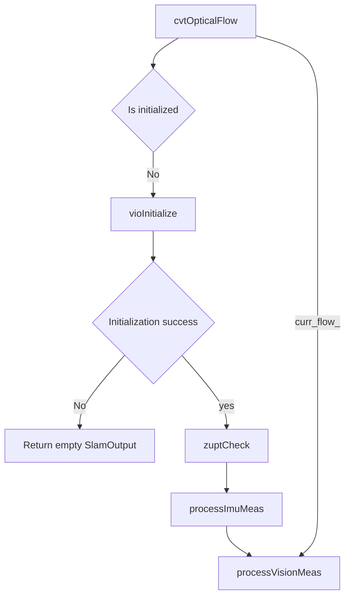

```mermaid
graph TD
    B[cvtOpticalFlow]
    B --> C{Is initialized}

    C -- No --> D[vioInitialize]
    D --> E{Initialization success}
    E -- No --> F[Return empty SlamOutput]
    %% E -- Yes --> G[Set initialized = true]
    E --yes--> H

    H[zuptCheck]

    %% G --> H
    H --> I[processImuMeas]
    I --> J[processVisionMeas]
    B --curr_flow_--> J
```