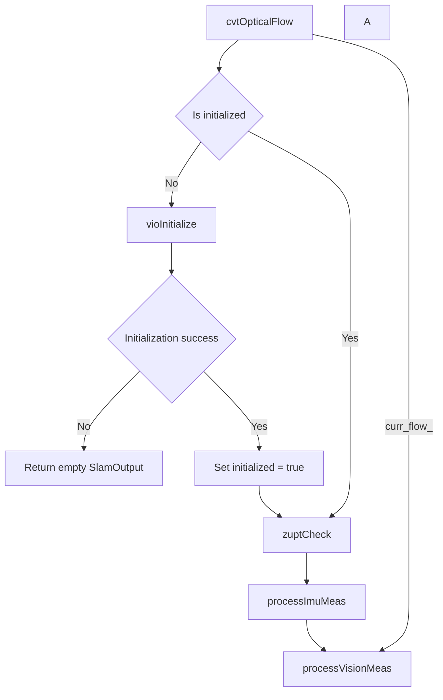

```mermaid
%% classDiagram
%%   class Solver {
%%     -params: VioOptimizationParam
%%     -calib: VioCalib*
%%     +solve()
%%     +marginalize()
%%     +linearizeSystem()
%%     +linearizeSystemMargin()
%%     +createVariablesAndFactors()
%%     +generateNewMarginPrior()
%%   }

%%   class VariableBase {
%%     +Index: int
%%     +Ptr: void*
%%   }

%%   class FactorBase {
%%     +Ptr: void*
%%     +linearize()
%%     +addDenseJr()
%%   }

%%   class EliminatorBase {
%%     +eliminateInPlace()
%%   }

%%   Solver o--> FactorBase
%%   Solver o--> VariableBase
%%   Solver o--> EliminatorBase
%%   Solver --> VioOptimizationParam
%%   Solver --> VioCalib


graph TD
    B[cvtOpticalFlow]
    B --> C{Is initialized}

    C -- No --> D[vioInitialize]
    D --> E{Initialization success}
    E -- No --> F[Return empty SlamOutput]
    E -- Yes --> G[Set initialized = true]

    C -- Yes --> H[zuptCheck]

    G --> H
    H --> I[processImuMeas]
    I --> J[processVisionMeas]
    B --curr_flow_--> J

    A
```