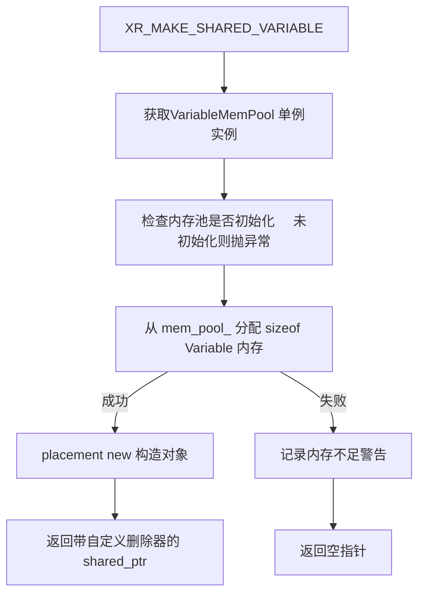

```mermaid
graph TD
  A[XR_MAKE_SHARED_VARIABLE]
  B[获取VariableMemPool 单例实例]
  C[检查内存池是否初始化     未初始化则抛异常]
  D[从 mem_pool_ 分配 sizeof Variable 内存]
  E1[placement new 构造对象]
  E2[记录内存不足警告]
  F1[返回带自定义删除器的 shared_ptr]
  F2[返回空指针]

  A --> B --> C --> D
  D -->|成功| E1 --> F1
  D -->|失败| E2 --> F2

```